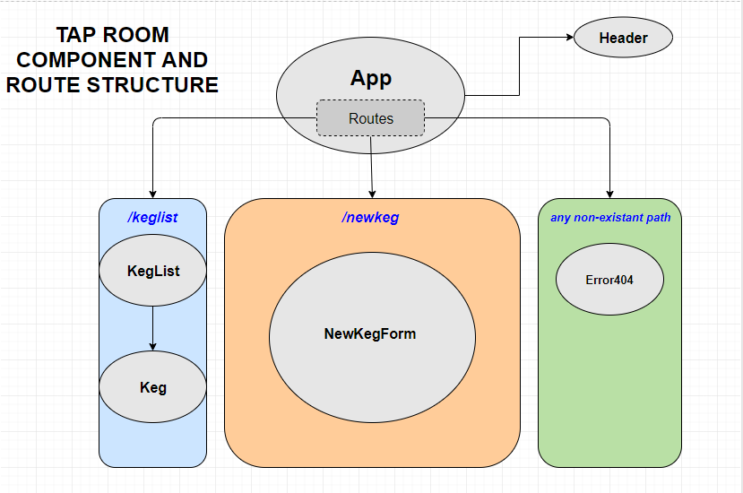

# Redux Tap Room App

## Epicodus React Level 2 Independent Project 

#### Project September 18, 2018

#### By Protatodev (Thad Donaghue)

## Description

This project is meant to mimic and recreate the angular tap-room project created in week 1 of angular. This project will attempt to recreate the structure and functionality of the angular app using React with Redux.

## Specifications

The app is built using React with Redux to manage the state of the project. The state is persistant and saved to local storage. Full CRUD functionality is present and allows the admin user to manage the kegs. The admin can sell pints, edit keg properties (name, etc..), remove kegs, and create new kegs. One reducer is used to accept action objects that indirectly manipulate the state.

## Setup Instructions

* Install Node.js.
* Clone the project repo.
* Run `yarn` from project directory.
* Run `yarn run dev-server` for a dev server.  It should bring up the page automatically, but navigate to `http://localhost:8080/#/` if it does not. The app will automatically reload if you change any of the source files.

## Technologies Used

* HTML5/CSS3
* Javascript / ES6 / ES7
* JSX
* Node.js
* React v16 / ReactDOM v16
* React Router
* Redux
* Jest
* SASS / SCSS
* React-Redux

## Links

* [Github Repo](https://github.com/protatodev/react-taproom-redux)
* Firebase Support Coming Soon!

## License

This software is licensed under the MIT license.

Copyright (c) 2018 **Protatodev**
